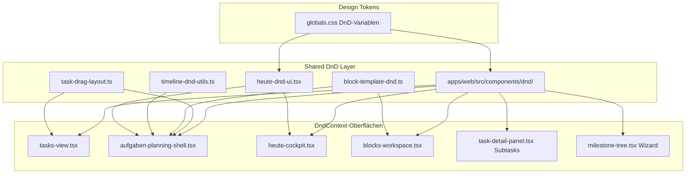

# Fokuna Drag-and-Drop — Technisches Übergabedokument

**Zweck:** Dieses Dokument beschreibt die Drag-and-Drop-Implementierung des Fokuna-Web-MVP so vollständig, dass ein Neubau der App das Verhalten **ohne Reverse-Engineering** rekonstruieren kann. Es fokussiert ausschließlich auf DnD und alle damit verbundenen Patterns, Techniken und Regeln.

**Stand:** Juli 2026 · Codebasis `@fokuna/web` (Next.js 15, React, TypeScript)

**Bewertung des MVP:** Das DnD-Verhalten gilt als **produktionsreif** und soll als Basis für die Neufakturierung dienen. Animationen sind flüssig, Sortierung springt nicht zurück, Ghost/Placeholder sind kongruent. Visuelle Feinabstimmungen sind bewusst ausgenommen.

---

## Inhaltsverzeichnis

1. [Technischer Stack](#1-technischer-stack)
2. [Architektur-Überblick](#2-architektur-überblick)
3. [Kernprinzipien (unverhandelbar)](#3-kernprinzipien-unverhandelbar)
4. [Gelöste Probleme (Lessons Learned)](#4-gelöste-probleme-lessons-learned)
5. [Design-Tokens & CSS](#5-design-tokens--css)
6. [Shared Module (`apps/web/src/components/dnd/`)](#6-shared-module-appswebsrccomponentsdnd)
7. [Drei Zustände: Normal · Placeholder · Ghost](#7-drei-zustände-normal--placeholder--ghost)
8. [Sortable-Listen (Standard-Pattern)](#8-sortable-listen-standard-pattern)
9. [Zonen-Wechsel (Timeline / Pool)](#9-zonen-wechsel-timeline--pool)
10. [DnD-Oberflächen im Detail](#10-dnd-oberflächen-im-detail)
11. [ID-Konventionen](#11-id-konventionen)
12. [Kollisionserkennung & Sensoren](#12-kollisionserkennung--sensoren)
13. [Persistenz & Optimistic Updates](#13-persistenz--optimistic-updates)
14. [Interaktionsregeln](#14-interaktionsregeln)
15. [Cursor Rules (übernommen)](#15-cursor-rules-übernommen)
16. [Tests & Abdeckung](#16-tests--abdeckung)
17. [Bekannte Inkonsistenzen](#17-bekannte-inkonsistenzen)
18. [Checkliste für den Neubau](#18-checkliste-für-den-neubau)

---

## 1. Technischer Stack

### Pakete (nur `apps/web`)

| Paket | Version (resolved) | Rolle |
|-------|-------------------|-------|
| `@dnd-kit/core` | 6.3.1 | `DndContext`, `DragOverlay`, `useDraggable`, `useDroppable`, Sensoren, Kollisionserkennung |
| `@dnd-kit/sortable` | 10.0.0 | `SortableContext`, `useSortable`, `arrayMove`, `verticalListSortingStrategy` |
| `@dnd-kit/modifiers` | 9.0.0 | `snapCenterToCursor` (Block-Rail-Ghost) |
| `@dnd-kit/utilities` | 3.2.2 | `CSS.Translate.toString()` — **niemals** `CSS.Transform.toString()` |

**Wichtig:** DnD existiert **nur in der Web-App**. Mobile ist laut PRD/Rules noch nicht implementiert; Timeline-DnD auf Mobile soll ggf. durch Time-Picker/Reorder-Controls ersetzt werden.

### State-Management

- **Kein Zustand-Store für DnD.** Drag-State lebt in lokalem React-State der jeweiligen Orchestrator-Komponente (`draggingTask`, `taskDragLayout`, `dropPreview`, …).
- **TanStack Query (tRPC):** Optimistische Cache-Updates bei Reorder; kein `invalidate()` nach erfolgreichem Reorder.
- **Einziger tangentialer Zustand-Store:** `aufgaben-calendar-open.ts` — öffnet Kalender-Sidebar automatisch, wenn eine Aufgabe beim Drag nahe dem rechten Bildschirmrand ist.

### Monorepo-Kontext

```
apps/web/          ← einziger DnD-Consumer
packages/ui/       ← CSS-Tokens (.dnd-ghost, .dnd-placeholder, …) in globals.css
packages/core/     ← poolInsertIndexForReturningTask (Pool-Rückkehr-Logik)
```

---

## 2. Architektur-Überblick



### Orchestrator vs. Leaf-Komponenten

| Rolle | Beispiel | Verantwortung |
|-------|----------|---------------|
| **Orchestrator** | `tasks-view.tsx`, `heute-cockpit.tsx` | Ein `DndContext`, Sensoren, Kollision, Handler, `DragOverlay` |
| **Sortable Leaf** | `task-row.tsx`, `block-template-rail.tsx` | `useSortable`, Placeholder-Rendering, `sortableItemStyle` |
| **Draggable Leaf** | `blocks-view.tsx`, `timeline.tsx` | `useDraggable` / `useDroppable`, keine Sortable-Transforms |
| **Domain Logic** | `task-drag-layout.ts` | Reine Funktionen: Layout-Mutation, Cross-Container-Moves |

---

## 3. Kernprinzipien (unverhandelbar)

Diese Regeln stammen aus `.cursor/rules/drag-and-drop.mdc` und der stabilen MVP-Implementierung.

### 3.1 Kongruenz: Item = Placeholder = Ghost

Drei visuelle Zustände müssen **dieselbe Surface-Komponente** nutzen:

| Zustand | Komponente | Beispiel |
|---------|------------|----------|
| Normal | `TaskRowSurface` | Interaktive Karte |
| Placeholder | `TaskRowSurface` + `LIST_DRAG_PLACEHOLDER_CLASS` | Inhalt unsichtbar, Rahmen sichtbar |
| Ghost | `DnDGhostShell` + `TaskRowSurface` | Folgt dem Cursor |

**Warum:** Unterschiedliche DOM-Strukturen führen zu Größen-Sprüngen, falschen Placeholder-Höhen und visuellem Flackern.

**Regeln für kongruente Surfaces:**
- Spalten (Favorit, Menü, Delete-Slot) per `reserveLayout` reservieren, wenn Controls ausgeblendet sind.
- Höhe/Breite beim `onDragStart` aus `event.active.rect.current.initial` messen.
- Gemessene Werte als `lockedHeight` / `width` an Placeholder **und** Ghost durchreichen.
- Variable Meta-Zeilen (Kategorie, Datum, Tags) dürfen die Höhe im Normalzustand ändern — Placeholder/Ghost halten die **gemessene Start-Höhe** fest.

### 3.2 Live-Reorder via `onDragOver` + `arrayMove`

```
onDragStart  → Layout-Snapshot + Größenmessung
onDragOver   → arrayMove / applyTaskDragOver (DOM-Reihenfolge live aktualisieren)
onDragEnd    → NUR persistieren (Mutation) — Reihenfolge steht bereits
```

**Ohne `onDragOver`-Reorder:** dnd-kit wendet beim Loslassen Transforms zurück → sichtbares **Zurückspringen** zur alten Position.

### 3.3 `CSS.Translate.toString()` — niemals `Transform`

```typescript
// apps/web/src/components/dnd/sortable-styles.ts
export function sortableItemStyle({ transform, transition, layoutControlled }) {
  if (layoutControlled) {
    return { transform: undefined, transition: undefined };
  }
  return {
    transform: transform ? DndCSS.Translate.toString(transform) : undefined,
    transition,
  };
}
```

`Transform` (mit Scale) verzerrt Elemente bei Sortable-Listen. `Translate` ist korrekt für vertikale Listen.

### 3.4 `layoutControlled` nur für das aktive Item

- **Aktives/isDragging Item:** `layoutControlled: true` → kein Transform (Placeholder übernimmt den Slot).
- **Geschwister:** behalten `transform` + `transition` von dnd-kit → **native Sortier-Animation**.

### 3.5 Ghost außerhalb des Layout-Flows

- Standard: `DragOverlay` mit `dropAnimation={null}` (Heute, Aufgaben, Blocks, Subtasks).
- Ausnahme: `tasks-view.tsx` nutzt `DragOverlay` **ohne** `dropAnimation={null}` — leicht andere Drop-Animation.
- Ghost erst nach Drop-Animation ausblenden: `scheduleTaskDragClear()` mit **250ms** Delay.

### 3.6 Kein `invalidate()` nach Reorder

Optimistisches `utils.task.list.setData()` reicht. Refetch verursacht **Flackern** und Race Conditions mit der Drop-Animation.

### 3.7 Keine Drag-Handles (Ausnahmen siehe §10)

Gesamtes Listenelement ist ziehbar. Interaktive Kinder: `onPointerDown={e => e.stopPropagation()}`.

---

## 4. Gelöste Probleme (Lessons Learned)

Diese Probleme existierten in früheren Iterationen und sind im MVP behoben. Beim Neubau unbedingt vermeiden.

### 4.1 Sortierung springt beim Loslassen zurück

**Symptom:** Element kehrt kurz zur Ursprungsposition zurück, dann aktualisiert sich die Liste.

**Ursache:** Nur `onDragEnd` mit `arrayMove` — dnd-kit-Transforms und DOM-Reihenfolge sind beim Drop nicht synchron.

**Lösung:** `onDragOver` aktualisiert die Datenreihenfolge live (`applyTaskDragOver` / `arrayMove` auf `subtaskOrder`). `onDragEnd` persistiert nur.

**Referenz:** `apps/web/src/components/tasks/task-drag-layout.ts` Zeile 79:
```typescript
/** Live-Reorder innerhalb eines Abschnitts (arrayMove in onDragOver – haelt DOM = Transform). */
```

### 4.2 Flackernde Ghost/Placeholder-Größe

**Symptom:** Placeholder zu klein/groß; Ghost springt beim Start.

**Ursache:** Unterschiedliche Komponenten für Normal/Placeholder/Ghost; Höhe nicht beim Drag-Start gemessen.

**Lösung:** Kongruenz-Prinzip (§3.1) + `lockedHeight` aus `event.active.rect.current.initial`.

### 4.3 Diagonales Clipping des Ghosts

**Symptom:** Rotierter Ghost wird an Ecken abgeschnitten.

**Ursache:** `box-shadow` + `overflow-hidden` auf rotierter Hülle.

**Lösung:** `filter: drop-shadow()` statt `box-shadow`; kein `overflow-hidden` auf der rotierten `.dnd-ghost`-Hülle.

### 4.4 Ghost-Flash nach Drop

**Symptom:** Ghost blinkt kurz nach dem Loslassen.

**Ursache:** Ghost-State sofort in `onDragEnd`/`finally` gelöscht.

**Lösung:** `scheduleTaskDragClear()` — 250ms Timeout vor State-Reset; Drop-Animation kann ablaufen.

### 4.5 Slot-Flackern beim langsamen Ziehen (Hysterese)

**Symptom:** Einfügeslot springt hin und her an Grenzen zwischen zwei Items.

**Ursache:** Reines Midpoint-Switching ohne Hysterese (bekanntes dnd-kit-Problem, GitHub #1456).

**Lösung (infrastruktur, optional):** `resolveInsertIndexWithHysteresis` in `sortable-insert-index.ts` mit `INSERT_HYSTERESIS_PX = 10`. Aktuelle Sortable-Listen nutzen primär `arrayMove` über `over.id` — Hysterese-Utilities sind für Spezialfälle vorbereitet.

### 4.6 Flackern nach Server-Refetch

**Symptom:** Liste springt nach erfolgreichem Drop kurz.

**Ursache:** `invalidate()` nach `reorderTasks`.

**Lösung:** Optimistisches Cache-Update; `invalidate()` nur im `catch`-Pfad bei Fehler.

### 4.7 Ghost vs. Zone-Placeholder gleichzeitig sichtbar

**Symptom:** Doppelte Darstellung beim Drag auf Timeline/Pool.

**Lösung:** Ghost ausblenden, wenn Zone-Placeholder aktiv:
```tsx
{activeDrag && !dropPreview && !poolDropPreview ? (
  <DragOverlay dropAnimation={null}>...</DragOverlay>
) : null}
```

**Form-Kongruenz:** Ghost und Zone-Placeholder wechseln **gemeinsam** zur Ziel-Darstellung (z. B. Timeline-Block-Größe).

---

## 5. Design-Tokens & CSS

**Datei:** `packages/ui/src/styles/globals.css`

### CSS-Variablen (`:root`)

| Variable | Wert (Auszug) | Zweck |
|----------|---------------|-------|
| `--dnd-ghost-opacity` | `0.92` | Transparenz Default-Ghost |
| `--dnd-ghost-rotate` | `-1deg` | Leichte Rotation (Karten) |
| `--dnd-ghost-compact-opacity` | `0.96` | Subtask-Ghost |
| `--dnd-placeholder-bg` | `hsl(var(--muted) / 0.65)` | Listen-Placeholder Hintergrund |
| `--dnd-placeholder-border` | `hsl(var(--border))` | Listen-Placeholder Rahmen |
| `--dnd-placeholder-opacity` | `1` | Listen-Placeholder Opazität |
| `--dnd-zone-placeholder-bg` | `hsl(177 79% 11% / 0.08)` | Timeline/Pool Zone |
| `--dnd-zone-placeholder-border` | `hsl(177 79% 11% / 0.45)` | Zone gestrichelt |
| `--dnd-source-opacity` | `0.35` | Quell-Element-Dimming ohne Listen-Placeholder |

### Utility-Klassen

```css
.dnd-ghost {
  opacity: var(--dnd-ghost-opacity);
  transform: rotate(var(--dnd-ghost-rotate));
  filter: drop-shadow(0 8px 24px rgba(6, 52, 50, 0.12))
    drop-shadow(0 2px 8px rgba(6, 52, 50, 0.06));
  pointer-events: none;
}

.dnd-ghost-compact {
  opacity: var(--dnd-ghost-compact-opacity);
  pointer-events: none;
  overflow: hidden;
}

.dnd-placeholder { /* fester Box-Placeholder */ }
.dnd-zone-placeholder { /* gestrichelte Zone */ }
.dnd-source-dim { opacity: var(--dnd-source-opacity); }
```

### Listen-Placeholder-Klasse

**Datei:** `apps/web/src/components/dnd/list-placeholder-class.ts`

```typescript
export const LIST_DRAG_PLACEHOLDER_CLASS = cn(
  'pointer-events-none shadow-none',
  'bg-[var(--dnd-placeholder-bg)] border-[var(--dnd-placeholder-border)]',
  'opacity-[var(--dnd-placeholder-opacity)]',
  '[&_*]:invisible',  // Inhalt unsichtbar, Layout erhalten
);
```

---

## 6. Shared Module (`apps/web/src/components/dnd/`)

**Pflicht:** Neue DnD-Stellen **immer** diese Module nutzen — keine lokalen Einmal-Lösungen.

### 6.1 `sortable-styles.ts` — das wichtigste Modul

| Export | Zweck |
|--------|-------|
| `sortableItemStyle()` | Transform/Transition für `useSortable`-Items |
| `computeGrabOffsetY()` | Griffpunkt → Elementmitte beim Start |
| `resolveDragCenterY()` | Echte Ghost-Mitte (nicht `active.rect.translated`!) |
| `measureSortableItemRects()` | DOM-Positionen für Insert-Index |
| `captureSortableDragSnapshot()` | Snapshot für erweiterte Reorder-Sessions |
| `reorderToIndex()` | Item an Index einfügen |

**Kritischer Kommentar in `resolveDragCenterY`:**
> NICHT `active.rect.translated` – das ist der Placeholder in der (umsortierten) Liste.

### 6.2 `dnd-ghost-shell.tsx`

Wrapper für alle `DragOverlay`-Inhalte.

| Prop | Werte | Verhalten |
|------|-------|-----------|
| `variant` | `default` \| `compact` | Rotation+Shadow vs. nur Transparenz |
| `rounded` | `none` \| `lg` \| `xl` \| `2xl` | Muss zum gezogenen Element passen |
| `width` / `height` | px aus Drag-Start | Feste Ghost-Größe |

### 6.3 `list-drag-ghost-portal.tsx`

Portal-basierter Ghost für scrollbare Modals.

| Export | Zweck |
|--------|-------|
| `ListDragGhostPortal` | `createPortal` an `document.body`, `position: fixed` |
| `overlayRectFromDragMove()` | Position aus Pointer + `grabOffsetY` |

**Status im MVP:** Exportiert, aber **nicht aktiv genutzt**. Subtasks nutzen bewusst `DragOverlay` (vermeidet Slot-Offset beim Live-Reorder in Modals).

### 6.4 `sortable-insert-index.ts`

| Export | Zweck |
|--------|-------|
| `resolveInsertIndexWithHysteresis()` | Schmitt-Trigger, 10px Hysterese |
| `resolveInsertIndexByDragCenter()` | Roher Index ohne Hysterese |

**Status:** Infrastruktur für Spezialfälle; Standard-Sortable nutzt `arrayMove` über `over.id`.

### 6.5 `sortable-drag-session.ts`

Session-State (`committedInsertIndex` + Snapshot) für pointer-basiertes Live-Reorder.

**Status:** Exportiert, **nicht aktiv genutzt** in aktuellen Oberflächen.

### 6.6 `dnd-placeholder.tsx`

Generischer Box-Placeholder (`DnDPlaceholder`) für nicht-Surface-basierte Fälle.

### 6.7 `index.ts`

Zentraler Re-Export — immer `import { ... } from '@/components/dnd'` verwenden.

---

## 7. Drei Zustände: Normal · Placeholder · Ghost

### Ablauf beim Drag-Start

```typescript
function handleDragStart(event: DragStartEvent) {
  const w = event.active.rect.current.initial?.width;
  const h = event.active.rect.current.initial?.height;
  setDragOverlayWidth(w ?? null);
  setDragOverlayHeight(h ?? null);
  setDraggingTask(task);
  setTaskDragLayout(serverTaskLayout); // Snapshot für Live-Reorder
}
```

### Placeholder im Sortable-Item (`task-row.tsx`)

```tsx
const { transform, transition, isDragging } = useSortable({ id: task.id, ... });
const style = sortableItemStyle({ transform, transition, layoutControlled: isDragging });

{isDragging ? (
  <TaskRowSurface
    className={LIST_DRAG_PLACEHOLDER_CLASS}
    reserveLayout
    lockedHeight={dragLockedSize?.height}
    showActions={false}
    aria-hidden
  />
) : (
  <TaskRowSurface task={task} ... />
)}
```

### Ghost im DragOverlay

```tsx
function TaskDragGhost({ task, width, height }) {
  return (
    <DnDGhostShell width={width} height={height}>
      <TaskRowSurface
        task={task}
        showActions={false}
        reserveLayout
        lockedHeight={height}
        className="h-full w-full"
      />
    </DnDGhostShell>
  );
}
```

---

## 8. Sortable-Listen (Standard-Pattern)

Dieses Pattern gilt für: Aufgabenlisten, Subtasks, Block-Rail, Milestones (vereinfacht).

### Schritt-für-Schritt

1. **Orchestrator** umschließt mit `DndContext` + `SortableContext` + `verticalListSortingStrategy`.
2. **Leaf** nutzt `useSortable({ id })` + `sortableItemStyle({ layoutControlled: isDragging })`.
3. **`onDragStart`:** Größe messen, Layout-Snapshot setzen.
4. **`onDragOver`:** `arrayMove` / `applyTaskDragOver` auf lokalen State.
5. **`onDragEnd`:** Mutation aufrufen; Ghost per Timeout ausblenden.
6. **`onDragCancel`:** State sofort zurücksetzen.

### Task-Layout für Multi-Container (`task-drag-layout.ts`)

Aufgabenlisten haben **mehrere Container** (Abschnitte + „ohne Abschnitt"):

```typescript
type TaskDragLayout = Record<string, string[]>;
// z. B. { "__no_section__": ["task-1"], "section-abc": ["task-2", "task-3"] }
```

| Funktion | Wann |
|----------|------|
| `buildTaskDragLayout()` | Initial aus Server-Daten |
| `applyTaskDragOver()` | `onDragOver` — Same- oder Cross-Container |
| `moveTaskSameContainer()` | `arrayMove` innerhalb eines Containers |
| `moveTaskCrossContainer()` | Item zwischen Abschnitten verschieben |
| `applyTaskLayoutToCache()` | Optimistisches TanStack-Query-Update |

### Subtasks (nested `DndContext` in Modal)

- Eigener `DndContext` im `task-detail-panel.tsx` — isoliert von der äußeren Aufgabenliste.
- `autoScroll={false}` im Modal.
- `DnDGhostShell variant="compact" rounded="none"`.
- Gleiches `onDragOver` + `arrayMove`-Pattern.

---

## 9. Zonen-Wechsel (Timeline / Pool)

Heute und Aufgaben-Kalender nutzen **kein Sortable** für die Timeline — stattdessen `useDraggable` + `useDroppable`.

### Zonen-Modell

| Zone-ID | Komponente | Akzeptiert |
|---------|------------|------------|
| `'timeline'` | `timeline.tsx` | Tasks, Templates, Blocks (Move) |
| `'task-pool'` | `task-pool.tsx` | Blocks mit `taskId` (Entplanen) |

### Zone-Placeholder statt Ghost

Beim Hover über eine Zone:
1. **Ghost ausblenden** (`!dropPreview && !poolDropPreview`)
2. **Zone-Placeholder anzeigen** an berechneter Position

**Timeline:** `TimelineDropGhost` — absolut positioniert, Minute → Pixel via `timelineMinuteTop()`.

**Pool:** `TaskPoolDropGhost` — entweder echte `PoolTaskCard` mit `LIST_DRAG_PLACEHOLDER_CLASS` oder generischer Zone-Placeholder.

### Drop-Preview-Berechnung

**Datei:** `apps/web/src/components/day-calendar/timeline-dnd-utils.ts`

- `minuteFromPointer()` — Y-Position → Minuten
- `computeDropPreview()` — Start/Ende, Label, Overlap-Spalten
- `snapToGrid()`, `clampStart()` — Raster und Tagesgrenzen

### Pool-Rückkehr-Insert-Index

**Datei:** `packages/core/src/tasks/logic.ts` → `poolInsertIndexForReturningTask()`

Berechnet, an welcher Position ein entplanter Task im Pool eingefügt wird.

### Block-Resize (nicht dnd-kit!)

Timeline-Blöcke haben **native Pointer-Events** für Resize-Handles (`resize-handle-top/bottom`). `resizingRef` deaktiviert `useDraggable` während Resize.

---

## 10. DnD-Oberflächen im Detail

### 10.1 Aufgabenliste (`tasks-view.tsx`)

| Aspekt | Wert |
|--------|------|
| **Container** | Ein `DndContext` für Rail + Liste |
| **Sortable** | Tasks, Sections, Categories |
| **Droppable** | Section-Bodies, Section-Gaps, Rail-Targets |
| **Sensor** | `PointerSensor`, `distance: 6` |
| **Kollision** | `pointerWithin` → Section-Gaps/Headers → `closestCenter` |
| **Ghost** | `DragOverlay` + `TaskDragGhost` (ohne `dropAnimation={null}`) |
| **Live-Reorder** | `applyTaskDragOver` in `onDragOver` |
| **Persist** | `reorderTasks`, `updateTask`, `reorderSections`, `reorderCategories` |
| **Clear-Delay** | 250ms |

**Zusätzliche Drop-Targets (kein Reorder):**
- Kategorie-Rail: `cat:{id}` → Kategorie zuweisen
- `rail-eingang` → Kategorie entfernen
- `rail-favorites` → Favorit setzen

### 10.2 Aufgaben-Planungsshell (`aufgaben-planning-shell.tsx`)

Erweitert 10.1 um **Kalender/Timeline** im selben `DndContext`.

| Zusätzlich | Detail |
|------------|--------|
| **Draggables** | Timeline-Blocks, Block-Templates (Rail + Add-Menu) |
| **`onDragMove`** | Timeline-Drop-Preview; Kalender auto-öffnen bei Drag nahe rechtem Rand (80px) |
| **`onDragOver`** | Task-Layout-Updates **überspringen** wenn über Timeline |
| **Ghost** | `dropAnimation={null}`; Task-Ghost + `DragOverlayPreview` für Blocks/Templates |
| **Drop** | `moveBlock`, `addFromTemplate`, `addFromTask`, `handleBlockRailDragEnd` |

### 10.3 Heute-Cockpit (`heute-cockpit.tsx`)

| Aspekt | Wert |
|--------|------|
| **Draggables** | Pool-Tasks, Timeline-Blocks, Block-Palette-Templates |
| **Sensoren** | `PointerSensor` distance 4 + `KeyboardSensor` |
| **Kollision** | `pointerWithin` → `rectIntersection` |
| **UI-Module** | `heute-dnd-ui.tsx` (Ghost/Placeholder-Komponenten) |
| **Pool-Preview** | `poolDropPreview` + `poolInsertIndexForReturningTask` |
| **Ghost** | Versteckt bei `dropPreview` oder `poolDropPreview` |

### 10.4 Blocks-Workspace (`blocks-workspace.tsx`)

| Aspekt | Wert |
|--------|------|
| **Bibliothek** | `useDraggable` (Library-Cards) |
| **Rail** | `useSortable` + `SortableContext` |
| **Modifier** | `snapCenterToCursor` auf `DragOverlay` |
| **Logik** | `handleBlockRailDragEnd()` in `block-template-dnd.ts` |
| **Aktionen** | Add (Lib→Rail), Remove (Rail→außen), Reorder (Rail intern) |
| **Source-Dim** | `dnd-source-dim opacity-40` während Drag |

### 10.5 Subtasks (`task-detail-panel.tsx`)

| Aspekt | Wert |
|--------|------|
| **Context** | Nested `DndContext`, `autoScroll={false}` |
| **Ghost** | `DnDGhostShell variant="compact" rounded="none"` |
| **Live-Reorder** | `arrayMove` auf `subtaskOrder` in `onDragOver` |
| **Persist** | `reorderTasks.mutate({ orderedIds, parentId })` |

### 10.6 Goal-Wizard Milestones (`milestone-tree.tsx`)

| Aspekt | Wert |
|--------|------|
| **Sortable** | Ja, mit `GripVertical`-Handle (**einzige Handle-Ausnahme**) |
| **Ghost** | **Kein** `DragOverlay` — Source mit `opacity-60` |
| **Keyboard** | `KeyboardSensor` + `sortableKeyboardCoordinates` |
| **Persist** | Nur lokaler Wizard-State (`onChange`) |
| **Limit** | Max. 7 Milestones |

### 10.7 Goal-Work-Panel (`goal-work-panel.tsx`)

- `draggable`-Prop existiert, aber **kein `DndContext`** — DnD ist deaktiviert.
- Für Neubau: entweder weglassen oder vollständig nach Standard-Pattern implementieren.

---

## 11. ID-Konventionen

| Domäne | ID-Format | Beispiel |
|--------|-----------|----------|
| Task | `{uuid}` | `clx...` |
| Section Header | `section:{id}` | `section:abc` |
| Section Body | `secbody:{id}` | `secbody:abc` |
| Section Gap | `section-gap:{id}` | `section-gap:abc` |
| Category Rail | `cat:{id}` | `cat:abc` |
| Eingang | `rail-eingang` | fest |
| Favoriten | `rail-favorites` | fest |
| Timeline | `timeline` | fest |
| Task Pool | `task-pool` | fest |
| Time Block | `block:{id}` | `block:abc` |
| Task (Draggable) | `task:{id}` | `task:abc` |
| Template (Draggable) | `template:{id}` | `template:abc` |
| Library Template | `library-template:{id}` | `library-template:abc` |
| Rail Template | `template:{id}` | `template:abc` |
| Rail Append | `rail-append` | fest |
| Block Rail | `block-rail` | fest |

**`active.data.current`:** Jeder Draggable setzt `{ type: 'task'|'section'|'block'|... }` für Kollisionslogik.

---

## 12. Kollisionserkennung & Sensoren

### Sensoren (einheitlich)

```typescript
// Standard (Tasks, Blocks, Subtasks)
useSensor(PointerSensor, { activationConstraint: { distance: 6 } })

// Heute, Milestones (empfindlicher)
useSensor(PointerSensor, { activationConstraint: { distance: 4 } })

// Heute zusätzlich
useSensor(KeyboardSensor, { coordinateGetter: sortableKeyboardCoordinates })
```

**Kein `TouchSensor`** — Touch nutzt Pointer-Events.

**Distance-Constraint:** Verhindert versehentliches Drag bei Klicks/Taps.

### Kollisions-Strategien

| Oberfläche | Strategie |
|------------|-----------|
| Tasks | Custom: `pointerWithin` → Filter nach `type` → `closestCenter` |
| Heute | `pointerWithin` → `rectIntersection` |
| Subtasks | `pointerWithin` → `closestCenter` |
| Blocks Rail | Custom: Rail-Targets priorisieren → `pointerWithin` → `closestCenter` |
| Milestones | `closestCenter` |

---

## 13. Persistenz & Optimistic Updates

### Task-Reorder (manueller Sort-Modus)

```typescript
// 1. Optimistisch
utils.task.list.setData(listFilter, (old) =>
  old ? applyTaskLayoutToCache(old, layout, sectionIds) : old,
);

// 2. Async persistieren
await updateTask.mutateAsync({ id, sectionId }); // bei Container-Wechsel
await reorderTasks.mutateAsync({ orderedIds, sectionId });

// 3. Nur bei Fehler
catch { void invalidate(); }
```

### Block-Rail

```typescript
handleBlockRailDragEnd(event, railIds, (orderedIds) => {
  updateRail.mutate({ orderedIds });
});
```

### Timeline-Drops

Sofortige Mutation (kein optimistisches Layout):
- `addFromTask.mutate({ date, taskId, startMin })`
- `addFromTemplate.mutate({ date, blockTemplateId, startMin })`
- `moveBlock.mutate({ id, startMin })`
- `removeBlock.mutate({ id })` (Pool-Rückkehr)

---

## 14. Interaktionsregeln

| Regel | Implementierung |
|-------|-----------------|
| Kein Drag-Handle (Standard) | `{...listeners}` auf `<li>` / Card |
| Handle-Ausnahme | Milestone-Wizard: `GripVertical`-Button |
| Interaktive Kinder isolieren | `onPointerDown={e => e.stopPropagation()}` |
| Composer/Eingaben isolieren | `stopPropagation` in `task-composer.tsx` |
| `touch-none` auf Drag-Surfaces | Verhindert Scroll-Konflikte |
| `cursor-grab` / `cursor-grabbing` | Visuelles Feedback |
| Popover offen halten während Drag | `dragSessionActive` in `block-add-menu.tsx` |

---

## 15. Cursor Rules (übernommen)

Vollständiger Wortlaut der produktiven DnD-Rule aus `.cursor/rules/drag-and-drop.mdc`:

---

### Drag and Drop (Fokuna)

Alle DnD-Interaktionen nutzen **@dnd-kit** und folgen denselben visuellen und technischen Regeln.

#### Design-Tokens (CSS-Variablen in `packages/ui/src/styles/globals.css`)

| Token | Zweck |
|-------|--------|
| `--dnd-ghost-opacity` | Transparenz des Cursor-Ghosts (DragOverlay) |
| `--dnd-ghost-rotate` | Leichte Rotation des Ghosts (`default` only) |
| `--dnd-ghost-shadow` | Legacy – `default` nutzt `filter: drop-shadow()` statt box-shadow |
| `--dnd-ghost-compact-opacity` | Transparenz für `compact`-Ghosts (Subtasks) |
| `--dnd-placeholder-bg` / `--dnd-placeholder-border` / `--dnd-placeholder-opacity` | Listen-Placeholder |
| `--dnd-zone-placeholder-bg` / `--dnd-zone-placeholder-border` | Zonen-Placeholder (Timeline, Pool) |
| `--dnd-source-opacity` | Ausgeblendetes Quell-Element wenn kein Listen-Placeholder |

Utility-Klassen: `.dnd-ghost`, `.dnd-ghost-compact`, `.dnd-placeholder`, `.dnd-zone-placeholder`, `.dnd-source-dim`

#### Kongruenz: Item = Placeholder = Ghost

Drei Zustände müssen **dieselbe Surface** (`TaskRowSurface`, `SubtaskRowSurface`, …) nutzen:

1. **Normal** – interaktiv
2. **Placeholder** – `LIST_DRAG_PLACEHOLDER_CLASS`, `reserveLayout`, `lockedHeight` aus Drag-Start-Messung
3. **Ghost** – `DnDGhostShell` / `ListDragGhostPortal`, gleiche Surface + `reserveLayout` + `lockedHeight`

Regeln:

- Spalten (Favorit, Menü, Delete-Slot) per `reserveLayout` reservieren, wenn interaktive Controls ausgeblendet sind.
- Höhe/Breite beim `onDragStart` aus `event.active.rect.current.initial` messen und an Placeholder **und** Ghost durchreichen.
- Variable Meta-Zeilen (Kategorie, Datum, Tags) dürfen die Höhe ändern – Placeholder/Ghost halten die **gemessene** Höhe fest.
- Ghost-Rotation: `drop-shadow` statt `box-shadow` + kein `overflow-hidden` auf der rotierten Hülle (verhindert diagonales Clipping).

#### Ghost (DragOverlay)

- Rendere den Ghost **außerhalb** des Layout-Flows. Standard: `DragOverlay` mit `dropAnimation={null}`.
- In **Modals/scrollbaren Containern**: `ListDragGhostPortal` mit `active.rect.translated` (via `onDragMove`) statt `DragOverlay`.
- Varianten in `DnDGhostShell`:
  - `default`: Rotation + drop-shadow (Aufgaben-Karten, Heute-Pool)
  - `compact`: nur Transparenz (Subtasks)
- Breite **und** Höhe aus Drag-Start-Messung; Inhalt füllt Shell mit `h-full w-full`.

#### Placeholder (Listen)

- 1:1-Kopie der Surface mit `LIST_DRAG_PLACEHOLDER_CLASS`: Inhalt `[&_*]:invisible`, Hintergrund/Rahmen sichtbar.
- `layoutControlled: dragSessionActive || isDragging` ab erstem Frame.

#### Sortable-Technik (dnd-kit + DragOverlay)

- **Niemals** `CSS.Transform.toString()` – immer `CSS.Translate.toString()` via `sortableItemStyle()`.
- **`onDragOver` + `arrayMove`**: DOM-Reihenfolge während Drag live aktualisieren (`applyTaskDragOver`). Ohne das resetten Transforms beim Loslassen → sichtbares Zurückspringen.
- **`layoutControlled` nur für `isDragging`** – Geschwister behalten `transform` + `transition`.
- **`onDragEnd`**: nur persistieren (Mutation), Reihenfolge steht schon aus `onDragOver`.
- **DragOverlay**: Ghost erst nach Drop-Animation ausblenden (`scheduleTaskDragClear`, ~250ms) – nicht sofort in `finally`.
- **Kein `invalidate()` nach Reorder** – optimistisches Cache-Update reicht; Refetch verursacht Flackern.
- Modal-Subtasks: gleiches `onDragOver`-Pattern + **`DragOverlay`** (kein manuelles Ghost-Portal – vermeidet Slot-Offset beim Live-Reorder). Zeilen/Ghost: `rounded-none`.

#### Zonen-Wechsel (Ausnahme: Heute Tagesplanung)

- Formwechsel zwischen Zonen (Pool → Timeline): Ghost **und** Placeholder wechseln gemeinsam zur Ziel-Darstellung.
- Heute-Logik in `heute-cockpit.tsx` / `heute-dnd-ui.tsx` als Referenz.

#### Interaktion

- Keine Drag-Handles – gesamtes Listenelement ziehbar.
- Interaktive Kinder: `onPointerDown={stopPropagation}`.
- Composer/Eingaben von DnD fernhalten.

#### Shared-Module

```
apps/web/src/components/dnd/
  dnd-placeholder.tsx
  dnd-ghost-shell.tsx
  list-drag-ghost-portal.tsx
  list-placeholder-class.ts
  sortable-styles.ts
  sortable-insert-index.ts
  sortable-drag-session.ts
  index.ts
```

Neue DnD-Stellen immer diese Module und Tokens verwenden – keine lokalen Einmal-Lösungen.

---

### Ergänzende Projekt-Regeln (aus `fokuna.mdc`)

- **Stack:** dnd-kit für Drag and Drop in der Web-App.
- **Mobile:** Timeline-DnD kann durch Time-Picker, Duration-Controls und einfache Reorder-Interaktionen ersetzt werden.
- **Zustand:** Nur für lokalen UI-State — nicht für Server-Drag-State.
- **Tests:** Keyboard/Mouse, Empty/Overflow-States bei DnD-UI-Änderungen verifizieren.

---

## 16. Tests & Abdeckung

### E2E (Playwright)

| Datei | Szenario |
|-------|----------|
| `apps/web/e2e/blocks.spec.ts` | Library → Rail Drag-Reorder; Remove + Drag zurück |
| `apps/web/e2e/tasks.spec.ts` | Task → Timeline Drag; Scheduled-Badge |

**Nicht abgedeckt:** Task-Listen-Reorder, Section-Reorder, Category-Reorder, Subtask-Reorder, Milestone-Reorder, Heute-Pool-Rückkehr, Keyboard-DnD.

### Unit-Tests (Domain, nicht dnd-kit)

| Datei | Was |
|-------|-----|
| `packages/core/src/tasks/logic.test.ts` | `poolInsertIndexForReturningTask` |
| `packages/core/src/tasks/schemas.test.ts` | `reorderTasksInput` |
| `packages/core/src/sections/schemas.test.ts` | `reorderSectionsInput` |
| `packages/core/src/goals/schemas.test.ts` | `reorderMilestonesInput` |

**Keine Unit-Tests** für `sortable-styles.ts`, `task-drag-layout.ts`, `sortable-insert-index.ts`.

### Empfohlene Tests für Neubau

1. Live-Reorder ändert DOM-Reihenfolge vor Drop (kein Zurückspringen).
2. Placeholder-Höhe = Ghost-Höhe = Original-Höhe bei variablem Inhalt.
3. Cross-Container-Move (Section A → Section B).
4. Timeline-Drop an korrekter Minuten-Position.
5. Ghost ausgeblendet wenn Zone-Placeholder aktiv.
6. Optimistisches Update ohne Refetch-Flackern.

---

## 17. Bekannte Inkonsistenzen

| # | Thema | Detail |
|---|-------|--------|
| 1 | `ListDragGhostPortal` ungenutzt | In Rules dokumentiert; Subtasks nutzen `DragOverlay` |
| 2 | Hysterese-Session ungenutzt | `sortable-drag-session.ts` exportiert, aber kein Consumer |
| 3 | `tasks-view` Drop-Animation | Kein `dropAnimation={null}` — leicht anderes Verhalten als andere Surfaces |
| 4 | `BLOCK_LIBRARY_DROPPABLE_ID` | In Remove-Logik referenziert, aber kein `useDroppable` registriert |
| 5 | Milestone-Handle | Widerspricht „kein Handle"-Regel — bewusste Wizard-Ausnahme |
| 6 | Goal-Work-Panel | `draggable`-Prop ohne `DndContext` — tot |
| 7 | Timeline-Resize | Separates Pointer-System, nicht dnd-kit |
| 8 | Kein TouchSensor | Nur PointerSensor |

---

## 18. Checkliste für den Neubau

### Phase 1: Fundament

- [ ] `@dnd-kit/core`, `@dnd-kit/sortable`, `@dnd-kit/modifiers`, `@dnd-kit/utilities` installieren
- [ ] CSS-Tokens aus `globals.css` übernehmen (oder äquivalente Design-System-Tokens)
- [ ] Shared-Module `apps/web/src/components/dnd/` portieren
- [ ] `sortableItemStyle()` als einzigen Transform-Weg etablieren
- [ ] `LIST_DRAG_PLACEHOLDER_CLASS` + `DnDGhostShell` als Pflicht-Pattern

### Phase 2: Sortable-Listen

- [ ] `onDragOver` + `arrayMove` Pattern implementieren **bevor** `onDragEnd`-Persistenz
- [ ] `layoutControlled: isDragging` auf aktive Items
- [ ] Größenmessung in `onDragStart`
- [ ] `scheduleDragClear(250ms)` für Ghost-Ausblendung
- [ ] Optimistische Updates ohne `invalidate()`

### Phase 3: Multi-Container (Tasks)

- [ ] `TaskDragLayout` Datenmodell
- [ ] `applyTaskDragOver` für Same/Cross-Container
- [ ] Section/Category-Rail-Drop-Targets

### Phase 4: Zonen-DnD (Timeline/Pool)

- [ ] `useDraggable` + `useDroppable` (kein Sortable)
- [ ] `TimelineDropGhost` / `TaskPoolDropGhost`
- [ ] Ghost-Verstecken bei aktivem Zone-Placeholder
- [ ] `timeline-dnd-utils.ts` Minute-Mathematik
- [ ] Separates Resize-System für Timeline-Blöcke

### Phase 5: Weitere Surfaces

- [ ] Blocks Workspace (Lib ↔ Rail)
- [ ] Subtasks (nested Context)
- [ ] Aufgaben-Planungsshell (unified Context)
- [ ] Milestones (Wizard, vereinfacht)

### Phase 6: Qualität

- [ ] E2E-Tests für kritische Flows
- [ ] `drag-and-drop.mdc` Rule in neuem Repo
- [ ] Keyboard-Sensor wo sinnvoll
- [ ] Mobile-Alternative für Timeline planen

---

## Anhang: Datei-Index

### Shared DnD

```
apps/web/src/components/dnd/
├── index.ts
├── dnd-placeholder.tsx
├── dnd-ghost-shell.tsx
├── list-drag-ghost-portal.tsx
├── list-placeholder-class.ts
├── sortable-styles.ts
├── sortable-insert-index.ts
└── sortable-drag-session.ts
```

### Domain-Utilities

```
apps/web/src/components/tasks/task-drag-layout.ts
apps/web/src/components/blocks/block-template-dnd.ts
apps/web/src/components/day-calendar/timeline-dnd-utils.ts
apps/web/src/components/heute/heute-dnd-ui.tsx
packages/core/src/tasks/logic.ts  (poolInsertIndexForReturningTask)
```

### Orchestratoren

```
apps/web/src/components/tasks/tasks-view.tsx
apps/web/src/components/aufgaben/aufgaben-planning-shell.tsx
apps/web/src/components/heute/heute-cockpit.tsx
apps/web/src/components/blocks/blocks-workspace.tsx
apps/web/src/components/tasks/task-detail-panel.tsx
apps/web/src/components/goals/wizard/milestone-tree.tsx
```

### Leaf-Komponenten

```
apps/web/src/components/tasks/task-row.tsx
apps/web/src/components/tasks/task-section.tsx
apps/web/src/components/tasks/tasks-category-rail.tsx
apps/web/src/components/heute/timeline.tsx
apps/web/src/components/heute/task-pool.tsx
apps/web/src/components/heute/block-palette.tsx
apps/web/src/components/blocks/blocks-view.tsx
apps/web/src/components/blocks/block-template-rail.tsx
apps/web/src/components/day-calendar/block-add-menu.tsx
```

### Styles & Rules

```
packages/ui/src/styles/globals.css
.cursor/rules/drag-and-drop.mdc
.cursor/rules/fokuna.mdc (DnD-relevante Auszüge)
```

### Tests

```
apps/web/e2e/blocks.spec.ts
apps/web/e2e/tasks.spec.ts
packages/core/src/tasks/logic.test.ts
```

---

*Ende des Übergabedokuments. Bei Fragen zur Rekonstruktion: zuerst §3 (Kernprinzipien) und §4 (Gelöste Probleme) lesen — dort stecken die kritischen Entscheidungen.*
